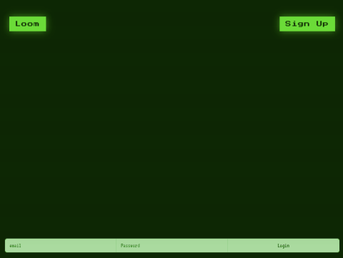

# Loom

## **Description**
Loom is a create your own adventure game in which players choose their fate through a series of answered questions and prompts. Users can further personalize their journey with custom paths and the ability to collect and store any item the along the way. Various packages and technologies such as Bootstrap, Handlebars.js, MySQL, Sequelize, Bad-words and Howler.js provide CSS framework, JavaScript, and audio to opimize user experience.  

- - - -
## **Table of Contents**
- [Usage](#usage)
- [Website Preview](#website-preview)
- [Credits](#credits)
    - [Collaborators](#collaborators)
    - [CSS Framework](#css-framework)
    - [JavaScript](#javascript)
    - [Audio](#audio)
    - [Additional](#additional)
- [License](#license)
- [How to Contribute](#how-to-contribute)
- - - -
## **Usage**
To access and use our project, click the "Loom" link shown in the [Website Preview](#website-preview) section below. 

Click on the "sign up" button at the top right to enter your name, email and password. After login, select a storyline and continue to follow the prompts as they appear. Each decision alters the escape journey, as players are able to create custom paths and items to collect, store and use along the way. 
 

- - - -
## **Website Preview**
[Loom](https://loom-story-633054131188.herokuapp.com/) 

- - - - 
## **Credits**

### **Collaborators:**  
- Andrew Evans- https://github.com/MrMcEvans
- Julian Losak- https://github.com/julianlosak 
- Joshua Stanford- https://github.com/stanjosh
- Alexis Strong- https://github.com/alexisstrong11

### **CSS Framework**
[Bootstrap](https://getbootstrap.com/docs/5.3/getting-started/introduction/ "Bootstrap")

### **JavaScript**
[Bad-words](https://www.npmjs.com/package/bad-words "Bad-words")

[Handlebars.js](https://handlebarsjs.com/guide/#installation "Handlebars.js")

### **Audio**
[Howler.js](https://github.com/goldfire/howler.js#documentation "Howler.js")

### **Additional**
[Sequelize](https://sequelize.org/docs/v6/getting-started/ "Sequelize")

[MySQL](https://www.mysql.com/ "MySQL")

- - - - 
## **License**
MIT License

Copyright (c) 2023 Andrew Evans, Julian Losak, Joshua Stanford, Alexis Strong

Permission is hereby granted, free of charge, to any person obtaining a copy
of this software and associated documentation files (the "Software"), to deal
in the Software without restriction, including without limitation the rights
to use, copy, modify, merge, publish, distribute, sublicense, and/or sell
copies of the Software, and to permit persons to whom the Software is
furnished to do so, subject to the following conditions:

The above copyright notice and this permission notice shall be included in all
copies or substantial portions of the Software.

THE SOFTWARE IS PROVIDED "AS IS", WITHOUT WARRANTY OF ANY KIND, EXPRESS OR
IMPLIED, INCLUDING BUT NOT LIMITED TO THE WARRANTIES OF MERCHANTABILITY,
FITNESS FOR A PARTICULAR PURPOSE AND NONINFRINGEMENT. IN NO EVENT SHALL THE
AUTHORS OR COPYRIGHT HOLDERS BE LIABLE FOR ANY CLAIM, DAMAGES OR OTHER
LIABILITY, WHETHER IN AN ACTION OF CONTRACT, TORT OR OTHERWISE, ARISING FROM,
OUT OF OR IN CONNECTION WITH THE SOFTWARE OR THE USE OR OTHER DEALINGS IN THE
SOFTWARE.
- - - - 
## **How to Contribute**
[Contributor Covenant](https://www.contributor-covenant.org/)

